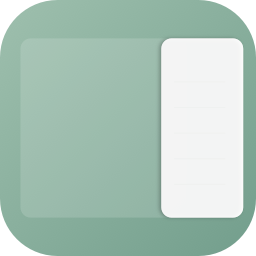

<div align="center">



# Open Sidenotes

**A minimal, elegant side panel for quick note-taking on macOS**

[](https://www.apple.com/macos/)
[](https://swift.org/)
[](LICENSE)
[](https://github.com/mlhiter/open-sidenotes/releases)

</div>

---

## Features

- **Edge Activation** — Move your mouse to the right edge of the screen to reveal the notes panel
- **Keyboard Shortcut** — Toggle window with customizable global shortcut (default: ⌘⌃Space)
- **Live Markdown** — Typora-style editing with real-time rendering while preserving source syntax
- **Auto Save** — Your notes are automatically saved as you type
- **Smart Auto-Hide** — Configurable auto-hide when mouse exits (0-3s delay)
- **Session Restore** — Automatically reopens your last note on launch
- **Customizable Settings** — Control Dock icon, storage location, and window behavior
- **Lightweight** — Native SwiftUI app with minimal resource usage
- **Always Available** — Works across all spaces and during full-screen apps
- **Local Storage** — Notes stored as Markdown files in customizable directory

## Installation

### Download

Download the latest release from [GitHub Releases](https://github.com/mlhiter/open-sidenotes/releases):

| Chip | Download |
|------|----------|
| Apple Silicon (M1/M2/M3) | [open-sidenotes-arm64.dmg](https://github.com/mlhiter/open-sidenotes/releases/latest/download/open-sidenotes-arm64.dmg) |
| Intel | [open-sidenotes-x86_64.dmg](https://github.com/mlhiter/open-sidenotes/releases/latest/download/open-sidenotes-x86_64.dmg) |

### Build from Source

```bash
git clone https://github.com/mlhiter/open-sidenotes.git
cd open-sidenotes
xcodebuild -project open-sidenotes.xcodeproj -scheme open-sidenotes build
```

## Usage

1. Launch the app — it runs as a menu bar utility
2. **Show panel**: Move mouse to the right edge OR press `⌘⌃Space`
3. Start writing in Markdown with live rendering
4. **Hide panel**: Move to edge again, press shortcut again, or let it auto-hide
5. Access settings from the menu bar icon

### Keyboard Shortcuts

| Shortcut | Action |
|----------|--------|
| `⌘⌃Space` | Toggle Window (customizable) |
| `⌘ F` | Find & Replace |
| `⌘ N` | New Note |

### Settings

Access settings to customize:
- **Appearance**: Show/hide Dock icon (requires restart)
- **Storage Location**: Choose where notes are saved
- **Window Behavior**: Enable auto-hide with custom delay (0-3s)
- **Keyboard Shortcuts**: Record custom shortcut for window toggle

### Markdown Support

```markdown
# Heading 1
## Heading 2

**bold** and *italic*

`inline code`

- List item
- Another item

1. Numbered
2. List
```

## Tech Stack

- **SwiftUI** + **AppKit** for native macOS experience
- **NSTextView** for rich text editing
- File-based storage with YAML front matter
- Zero external dependencies

## Contributing

Contributions are welcome! Feel free to:

1. Fork the repository
2. Create your feature branch (`git checkout -b feature/amazing`)
3. Commit your changes (`git commit -m 'Add amazing feature'`)
4. Push to the branch (`git push origin feature/amazing`)
5. Open a Pull Request

## License

[MIT](LICENSE) © mlhiter

---

<div align="center">

**[Report Bug](https://github.com/mlhiter/open-sidenotes/issues)** · **[Request Feature](https://github.com/mlhiter/open-sidenotes/issues)**

</div>
